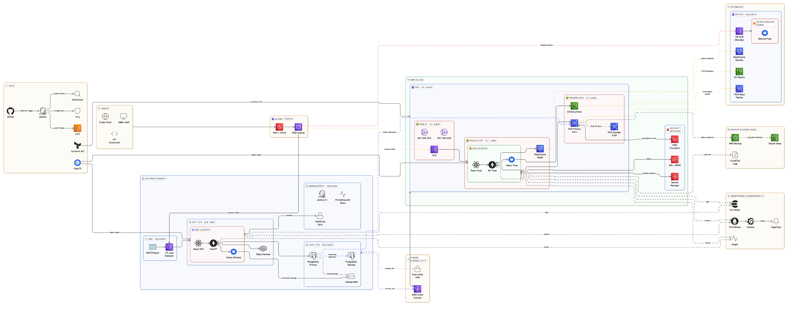

# Enterprise Hybrid Architecture with Disaster Recovery

---

## 📌 Overview

This project defines a Hybrid Enterprise Architecture integrating:

- On-Premises Primary Infrastructure
- AWS Primary Region
- AWS Disaster Recovery (DR) Region
- Hybrid Connectivity (Direct Connect + VPN)
- Kubernetes-based container orchestration
- Enterprise-grade security, monitoring, and CI/CD

The system is designed to achieve:

- 99.9% availability
- Multi-AZ high availability
- Cross-region disaster recovery
- Secure hybrid connectivity
- Scalable microservices deployment

---

# 🏗 Architecture Components

## 1️⃣ On-Premises Primary Environment

### Network Segmentation (VLAN&VPC-based)
- DMZ Network
- Kubernetes Cluster Network
- Database Network
- Monitoring Network

### Core Components
- WAF
- Load Balancer
- Kubernetes Cluster
  - React SPA
  - FastAPI/Django Backend
  - Celery Workers
- PostgreSQL Primary
- Document Storage
- Redis Primary

---

## 2️⃣ AWS Primary Region

### VPC Design
- Public Subnets (ALB + WAF)
- Private App Subnets (EKS Worker Nodes)
- Private Data Subnets (RDS, ElastiCache)
- NAT Gateway for outbound traffic
- Security Groups + NACL isolation

### Components

#### AWS DMZ
- AWS WAF + Shield
- Application Load Balancer (ALB)

#### EKS Cluster
- React SPA
- FastAPI/Django
- Celery Workers
- Horizontal Pod Autoscaler

#### Data Layer
- Amazon RDS PostgreSQL (Multi-AZ)
- ElastiCache (Redis)
- S3 Document Storage

---

## 3️⃣ AWS Disaster Recovery (DR) Region

### DR Model: Warm Standby

- Standby ALB
- Scaled-down EKS cluster
- RDS Cross-Region Read Replica
- S3 Cross-Region Replication
- ElastiCache replication

Failover is handled via:
- Route53 DNS switch
- RDS promotion
- EKS scale-up

---

# 🌐 Traffic Flow

Users → Route53 → WAF → ALB → EKS → RDS / S3 / ElastiCache

Hybrid flow:
On-Prem ↔ Direct Connect ↔ AWS
Backup Path: VPN

---

# 🔁 High Availability Design

## Multi-AZ Strategy (Primary Region)

- ALB deployed across multiple AZs
- EKS worker nodes in multiple AZs
- RDS Multi-AZ standby
- ElastiCache cluster mode

## Target Availability

| Metric | Value |
|--------|--------|
| Uptime | 99.9% |
| Max Downtime / Year | ~8.76 hours |
| RTO | < 60 minutes |
| RPO | < 15 minutes |

---

# 🔄 Disaster Recovery Strategy

## Replication Strategy

| Component | Replication Type |
|------------|------------------|
| RDS | Cross-Region Replica |
| S3 | Cross-Region Replication |
| Snapshots | Daily Automated |
| Backups | S3 Cross-Region |

## Failover Steps

1. Detect outage
2. Promote RDS replica
3. Scale DR EKS
4. Switch Route53 DNS
5. Validate system health

---

# 🔐 Security Architecture

## Identity & Access

- IAM Roles
- Kubernetes RBAC
- Least Privilege Model
- MFA Enforcement

## Encryption

- TLS in transit
- KMS encryption at rest
- Secrets Manager for credentials

## Perimeter Security

- WAF (Layer 7)
- Shield (DDoS Protection)
- Security Groups
- Network ACLs

---

# 📊 Monitoring & Observability

## Monitoring Stack

- Prometheus
- Grafana
- ELK Stack
- Alerting System

---

# 🚀 CI/CD Pipeline

Code Scan → Jenkins → Docker Build → Push to ECR → Deploy via IaC → Kubernetes Rolling Update

---

# 🔗 Hybrid Connectivity

## Primary Link
- AWS Direct Connect

## Secondary Link
- Site-to-Site VPN

---

# 💾 Backup Strategy

- RDS Automated Backups
- RDS Snapshots
- S3 Cross-Region Replication
- Daily backup schedule

---

# 📘 Conclusion

This hybrid architecture provides:

- Enterprise-grade security
- High availability with Multi-AZ
- Cross-region disaster recovery
- Cloud-native scalability
- Operational resilience
